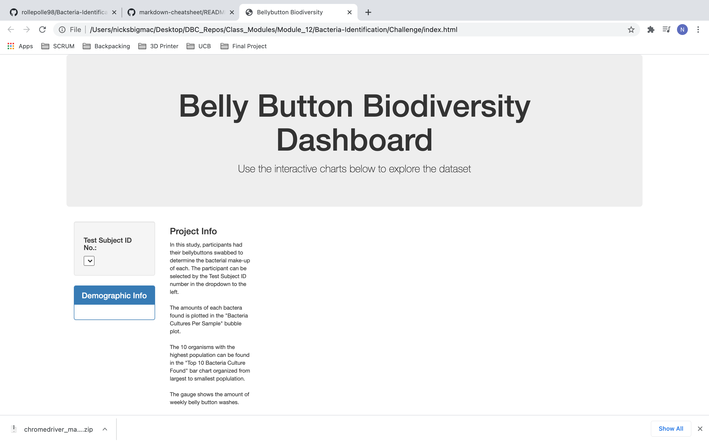
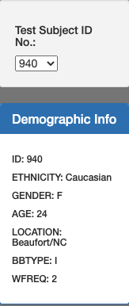
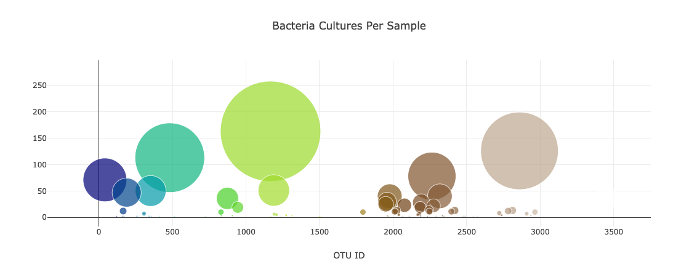
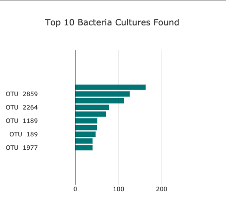

# Bacteria-Identification

## Purpose
The purpose of this repository to take the belly button data and transform it into a mix of a bunch of different charts. The original sample.json file holds the data needed in order to create visuals that will help analyze the data. Using bootstrap along with javascript and html , we were then able to populate these charts based on the ID number.

## Results

Step 1

Step 2 

Step 3 

Step 4

Step 5

