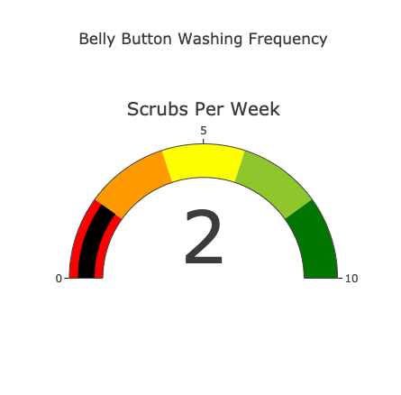

# Bacteria-Identification

## Purpose
The purpose of this repository to take the belly button data and transform it into a mix of a bunch of different charts. The original sample.json file holds the data needed in order to create visuals that will help analyze the data. Using bootstrap along with javascript and html , we were then able to populate these charts based on the ID number.

## Results

Step 1 : Creating the basis of Belly Button Dashboard

Step 2 : Ensure that the data loads in

Step 3 : Create and Horizontal Bar Chart.

Step 4 : Create a Bubble Chart

Step 5 : Create a Gauge Chart

## Summary 

Overaqll taking the data and transofrming into a site based on different charts helped visualize the data in multiple different charts based on particular subject ID.
